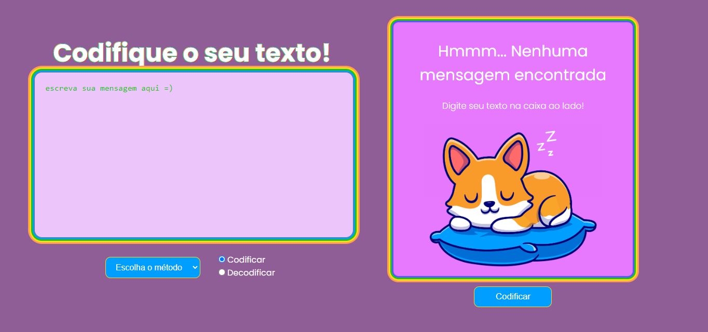
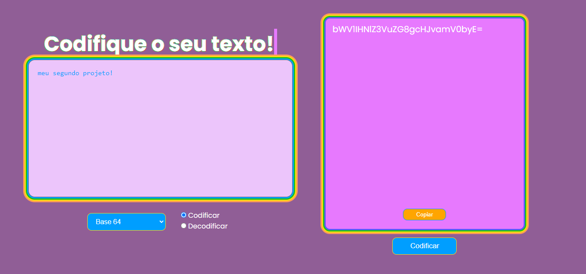

<h1  align="center"> :dog: Codificador de Texto  </h1>

<h2> :mega: Descrição da Página </h2>

Esse é o meu segundo projeto individual do curso Programadores Cariocas, você pode testar clicando <a href="https://daysecampos.github.io/codificador/">aqui</a>, acessando o link na descrição ou baixando =) O objetivo era fazer um codificador de texto, capaz de codificar e decodificar uma mensagem em Cifra de César ou Base64.

O projeto contém uma página só, o usuário deve escrever na área esquerda a mensagem que quer encriptar, em seguida escolher o método (Cifra de César ou Base64), se quer codificar ou decodificar e clicar no botão, o resultado irá aparecer na área da direita. Se o método escolhido for Cifra de César, o usuário também pode escolher a rotação que será feita a cifra.

Além de tudo, também há um botão de copiar, completamente funcional!

 

<strong> :lock: Texto codificado em Base64</strong>

  

 

<strong> :unlock: Texto decodificado</strong>

  

<h2> :computer: Tecnologias Utilizadas </h2>

<ul>
<li>HTML: Toda a estrutura da página foi feita com o HTML; </li>
<li>CSS: Um toque especial na estilização foi um efeito de typing feito inteiramente com o CSS, além de todo o resto da estilização; </li>
<li>Javascript: O objetivo desse projeto era treinar nossas habilidades em manipulação de DOM aprendidas em aula, assim como reforçar e desenvolver conceitos de lógica, funções e manipulação de arrays, todas essas funcionalidades foram utilizadas.</li>
</ul>
